# 🤖 Planora — AI-Powered Event Orchestration Platform

An intelligent event management platform that integrates task tracking, real-time collaboration, and AI-powered decision support using Large Language Models (LLMs).

---

## 🚀 Overview

Planora is a full-stack application designed to help event managers efficiently plan, manage, and execute events from a unified platform.

It combines real-time system capabilities with an AI-powered chatbot that delivers context-aware insights, recommendations, and automation using live event data.

---

## ✨ Key Features

- 🤖 AI Chatbot for event-related queries and decision support  
- 📋 Task Management & Scheduling  
- 💬 Real-time Communication using WebSockets  
- 📊 Event Analytics & Insights  
- 🧠 AI-powered capabilities:
  - Task suggestions  
  - Event summaries  
  - Risk mitigation guidance  
  - Automated communication drafts  
- 🔄 Dual LLM Integration (Groq + Ollama fallback)

---

## 🏗️ System Architecture / Workflow

User → React Frontend → Django Backend (ASGI + Channels) →  
Context Processing → LLM (Groq / Ollama) → Response → UI

---

## 🛠️ Tech Stack

### 🔹 Backend
- Django 5, Django REST Framework  
- Channels (ASGI) + Daphne  

### 🔹 Frontend
- React 18, Vite, Tailwind CSS  

### 🔹 Database
- SQLite (local development)  
- PostgreSQL (production)  

### 🔹 Real-Time
- WebSockets (Django Channels)  

### 🔹 AI / LLM
- Groq API (cloud LLM)  
- Ollama (local fallback, LLaMA3)  

---

## 🤖 AI System Design

- Event-aware chatbot using live task and event data  
- Context-aware prompt construction for relevant responses  
- Dual LLM routing for reliability and fault tolerance  
- Supports multi-turn conversations with context retention  

---

## 📸 Screenshots

### 🏠 Landing Page (Home 1)
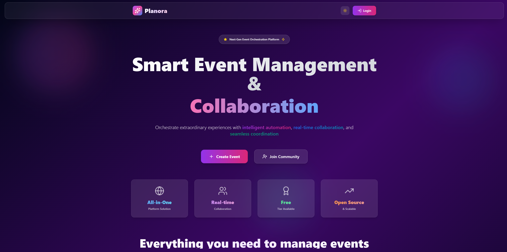

### 🏠 Landing Page (Home 2)
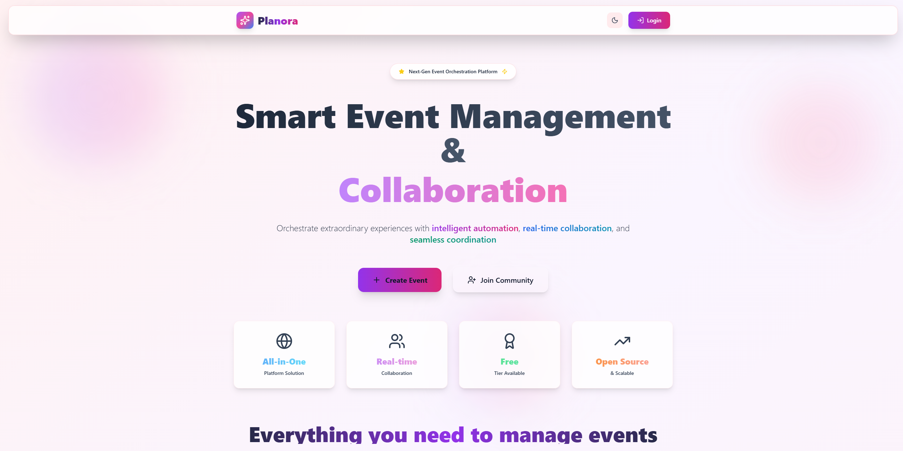

### 📝 Register Page
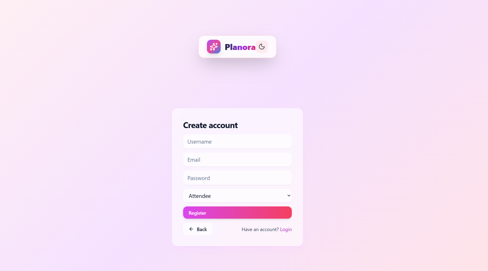

### 🔐 Login Page
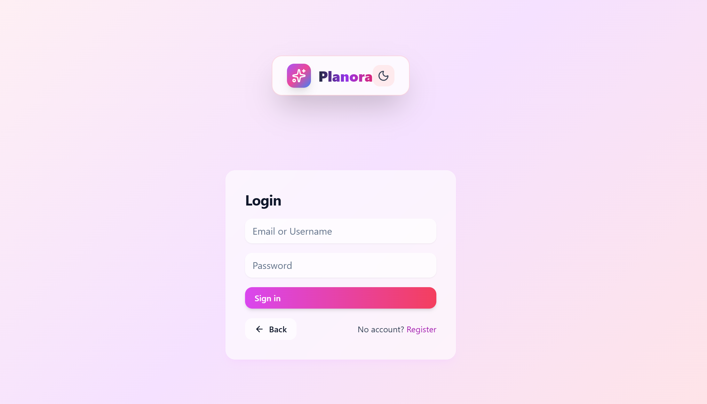

### 📊 Main Dashboard
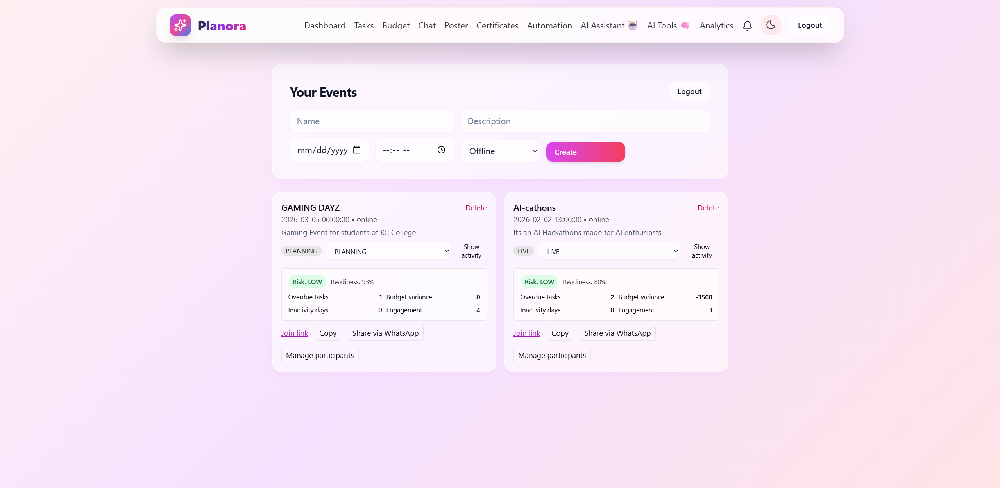

---

### 🤖 Chat Interface
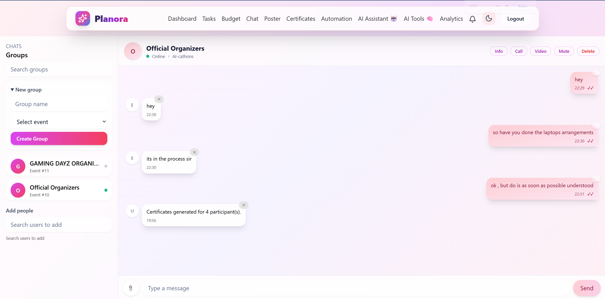

### 🧠 AI Assistant Features
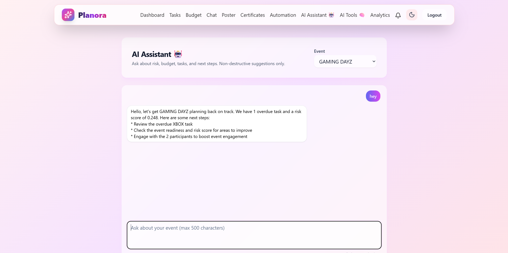

### 🛠️ AI Tools Panel
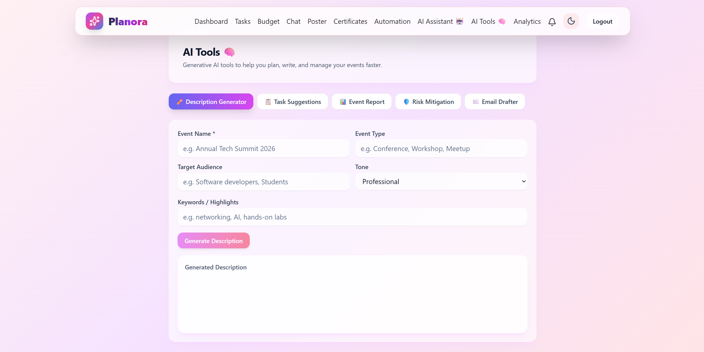

### 📋 Task Management
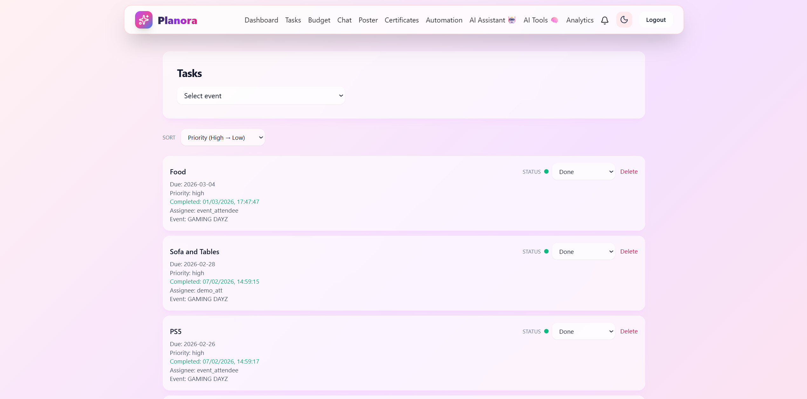

### 💰 Budget Management
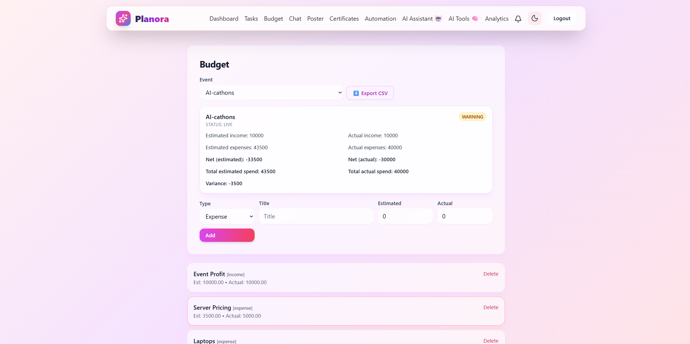

### 🏆 Certificate Generation
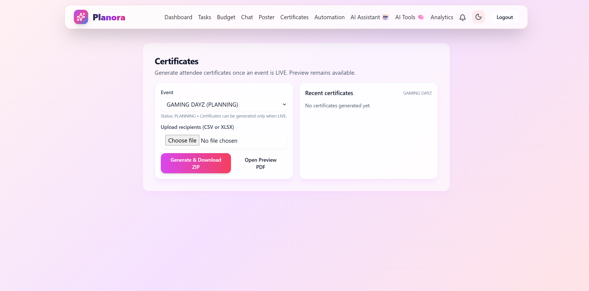

### 🎨 Poster Generation
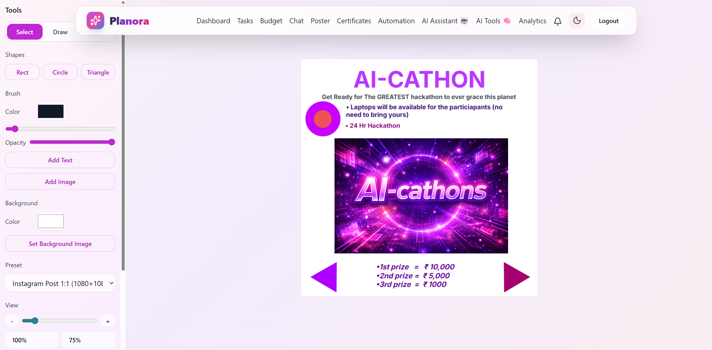

---

### Prerequisites
- Python 3.10+
- Node.js 18+
- Git
- (Optional) Docker + Docker Compose

---
